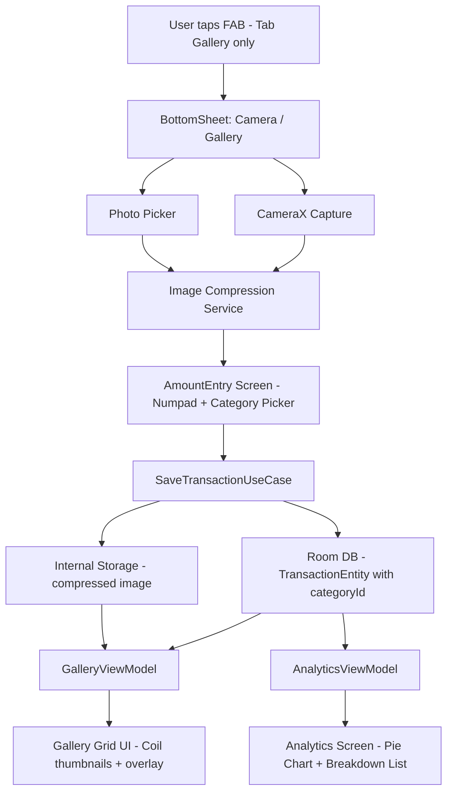

# Design: Visual Money Tracker

## Overview

Visual Money Tracker là ứng dụng Android giúp người dùng theo dõi thu/chi thông qua hình ảnh hóa. Thay vì nhập mô tả văn bản, người dùng chụp ảnh hoặc chọn ảnh từ thư viện, gắn số tiền và phân loại Thu/Chi. Dữ liệu được hiển thị dạng lưới ảnh (gallery grid) với overlay số tiền trực tiếp trên ảnh.

Ứng dụng hoạt động offline-first với Room Database, hỗ trợ đồng bộ cloud qua OAuth 2.0 (Google Drive / Box), và gửi nhắc nhở định kỳ qua WorkManager.

**Tech Stack:**
- Kotlin + Jetpack Compose
- MVVM + Clean Architecture
- CameraX, Coil, Room, WorkManager
- OAuth 2.0 (Google Drive API / Box API)

---

## Architecture

Ứng dụng tuân theo Clean Architecture với 3 layer chính:

```
┌─────────────────────────────────────────────┐
│              Presentation Layer              │
│  (Jetpack Compose UI + ViewModel + State)   │
├─────────────────────────────────────────────┤
│               Domain Layer                  │
│     (Use Cases + Domain Models + Repos)     │
├─────────────────────────────────────────────┤
│                Data Layer                   │
│  (Room DB + File Storage + Cloud API + WM)  │
└─────────────────────────────────────────────┘
```

### Luồng dữ liệu (Data Flow)



### Module Structure

```
app/
├── presentation/
│   ├── gallery/          # GalleryScreen, GalleryViewModel
│   ├── analytics/        # AnalyticsScreen, AnalyticsViewModel
│   ├── input/            # AmountEntryScreen, InputViewModel
│   ├── settings/         # SettingsScreen, SettingsViewModel
│   │   ├── category/     # CategoryManagementScreen, CategoryViewModel
│   │   └── wallet/       # WalletManagementScreen, WalletViewModel
│   └── components/       # FAB, BottomSheet, TransactionCard, AmountOverlay
├── domain/
│   ├── model/            # Transaction, TransactionType, Category, Wallet
│   ├── repository/       # TransactionRepository (interface), SyncRepository,
│   │                     # CategoryRepository (interface), WalletRepository (interface)
│   └── usecase/          # SaveTransaction, GetTransactions, DeleteTransaction,
│                         # SyncToCloud, ScheduleReminder,
│                         # GetCategories, SaveCategory, DeleteCategory,
│                         # GetWallets, SaveWallet, DeleteWallet, GetWalletBalance
├── data/
│   ├── local/
│   │   ├── db/           # AppDatabase, TransactionDao, TransactionEntity,
│   │   │                 # CategoryDao, CategoryEntity,
│   │   │                 # WalletDao, WalletEntity
│   │   └── file/         # ImageStorageManager, ImageCompressor
│   ├── remote/
│   │   └── cloud/        # GoogleDriveService, BoxService, CloudSyncManager
│   └── worker/           # ReminderWorker (WorkManager)
└── di/                   # Hilt modules
```

---

## Components and Interfaces

### 1. Bottom Navigation & NavGraph

Ứng dụng dùng `BottomNavigation` với 3 tab cố định. FAB chỉ hiển thị khi `currentRoute == Gallery`.

```kotlin
enum class BottomNavTab(val route: String, val icon: ImageVector, val label: String) {
    GALLERY("gallery", Icons.Default.GridView, "Gallery"),
    ANALYTICS("analytics", Icons.Default.BarChart, "Analytics"),
    SETTINGS("settings", Icons.Default.Settings, "Settings")
}

// NavGraph routes
sealed class Screen(val route: String) {
    object Gallery : Screen("gallery")
    object Analytics : Screen("analytics")
    object Settings : Screen("settings")
    object AmountEntry : Screen("amount_entry?imagePath={imagePath}") {
        fun createRoute(imagePath: String) = "amount_entry?imagePath=$imagePath"
    }
    object CategoryManagement : Screen("category_management")
}
```

### 2. GalleryScreen (Presentation)

Màn hình chính hiển thị lưới ảnh giao dịch, nhóm theo tháng.

```kotlin
@Composable
fun GalleryScreen(viewModel: GalleryViewModel)

data class GalleryUiState(
    val groupedTransactions: Map<YearMonth, List<Transaction>>,
    val selectedMonth: YearMonth,
    val wallets: List<Wallet>,
    val selectedWalletId: Long?,   // null = tất cả ví, non-null = filter theo ví cụ thể
    val totalBalance: Double,      // tổng số dư tất cả ví (hoặc số dư ví đang filter)
    val isLoading: Boolean,
    val error: String?
)
```

**Thành phần con:**
- `MonthHeader` – tiêu đề tháng + tổng thu/chi của tháng
- `TransactionGrid` – `LazyVerticalGrid` với `TransactionCard`
- `TransactionCard` – thumbnail ảnh vuông + `AmountOverlay`
- `AmountOverlay` – số tiền + icon mũi tên, background bán trong suốt, góc dưới ảnh
- `CameraFab` – FAB icon camera cố định góc phải dưới, chỉ hiển thị ở Tab Gallery

### 3. InputFlow (Presentation)

```kotlin
// BottomSheet options
sealed class InputOption {
    object TakePhoto : InputOption()
    object PickFromGallery : InputOption()
}

// AmountEntryScreen state
data class AmountEntryUiState(
    val imagePath: String,
    val amount: String,          // raw numpad input
    val transactionType: TransactionType,
    val selectedCategoryId: Long,  // bắt buộc, mặc định ID của "Khác"
    val availableCategories: List<Category>,
    val selectedWalletId: Long?,   // bắt buộc, null khi chưa chọn (hoặc auto-select nếu chỉ có 1 ví)
    val availableWallets: List<Wallet>,
    val isSaving: Boolean,
    val error: String?
)
```

### 4. AnalyticsScreen (Presentation)

```kotlin
@Composable
fun AnalyticsScreen(viewModel: AnalyticsViewModel)

data class CategoryBreakdown(
    val category: Category,
    val amount: Double,
    val percentage: Float,   // 0f..100f
    val color: Color
)

data class AnalyticsUiState(
    val selectedMonth: YearMonth,
    val totalIncome: Double,
    val totalExpense: Double,
    val viewMode: TransactionType,          // EXPENSE hoặc INCOME
    val breakdowns: List<CategoryBreakdown>,
    val wallets: List<Wallet>,
    val selectedWalletId: Long?,            // null = tất cả ví, non-null = filter theo ví cụ thể
    val isLoading: Boolean,
    val error: String?
)
```

**Thành phần con:**
- `MonthSwitcher` – chuyển tháng (dùng lại pattern từ GalleryScreen)
- `MonthlySummaryHeader` – hiển thị tổng Thu + tổng Chi
- `ExpenseIncomeToggle` – toggle giữa Expense / Income view
- `CategoryPieChart` – Pie chart với mỗi slice hiển thị tên category, %, số tiền
- `CategoryBreakdownList` – danh sách bên dưới chart, màu nhất quán với chart
- `WalletFilterChips` – chip selector để filter theo ví hoặc xem tất cả

### 4b. WalletManagementScreen (Presentation)

```kotlin
@Composable
fun WalletManagementScreen(viewModel: WalletViewModel)

data class WalletUiState(
    val wallets: List<WalletWithBalance>,  // ví + số dư hiện tại
    val isLoading: Boolean,
    val error: String?
)

data class WalletWithBalance(
    val wallet: Wallet,
    val currentBalance: Double  // openingBalance + sum(INCOME) - sum(EXPENSE)
)
```

**Thành phần con:**
- `WalletListItem` – tên ví + số dư hiện tại + nút sửa/xóa
- `AddWalletDialog` – dialog nhập tên ví và opening balance
- `DeleteWalletDialog` – dialog hỏi chuyển giao dịch sang ví khác hay xóa luôn

### 5. Domain Models

```kotlin
enum class TransactionType { INCOME, EXPENSE }

data class Transaction(
    val id: Long,
    val type: TransactionType,
    val amount: Double,
    val categoryId: Long,        // tham chiếu đến Category.id
    val walletId: Long,          // tham chiếu đến Wallet.id (bắt buộc)
    val imagePath: String,
    val timestamp: LocalDateTime
)

data class Category(
    val id: Long,
    val name: String,
    val isPreset: Boolean,
    val icon: String?            // tên icon resource hoặc null
)

data class Wallet(
    val id: Long,
    val name: String,            // tên tùy chỉnh, ví dụ: "Tiền mặt", "Ví MoMo"
    val openingBalance: Double,  // số dư ban đầu khi tạo ví
    val createdAt: LocalDateTime
)

// Preset category names (seeded on first install)
val PRESET_CATEGORIES = listOf(
    "Ăn uống", "Di chuyển", "Mua sắm", "Giải trí",
    "Sức khỏe", "Hóa đơn", "Thu nhập", "Khác"
)
```

### 6. Repository Interfaces

```kotlin
interface TransactionRepository {
    fun getTransactionsByMonth(year: Int, month: Int): Flow<List<Transaction>>
    fun getTransactionsByMonthAndWallet(year: Int, month: Int, walletId: Long): Flow<List<Transaction>>
    suspend fun saveTransaction(transaction: Transaction): Long
    suspend fun deleteTransaction(id: Long)
    suspend fun getAllTransactions(): List<Transaction>
    suspend fun getTransactionsByWallet(walletId: Long): List<Transaction>
    suspend fun reassignWallet(fromWalletId: Long, toWalletId: Long)
    suspend fun deleteTransactionsByWallet(walletId: Long)
}

interface CategoryRepository {
    fun getAll(): Flow<List<Category>>
    suspend fun getById(id: Long): Category?
    suspend fun insert(category: Category): Long
    suspend fun update(category: Category)
    suspend fun delete(id: Long)                    // chỉ cho custom categories
    suspend fun reassignToFallback(fromCategoryId: Long, fallbackId: Long)  // cascade
    suspend fun seedPresets()                       // gọi khi first install
}

interface WalletRepository {
    fun getAll(): Flow<List<Wallet>>
    suspend fun getById(id: Long): Wallet?
    suspend fun insert(wallet: Wallet): Long
    suspend fun update(wallet: Wallet)
    suspend fun delete(id: Long)
    suspend fun reassignTransactions(fromWalletId: Long, toWalletId: Long)
}

interface SyncRepository {
    suspend fun syncToCloud(provider: CloudProvider): Result<Unit>
    suspend fun authenticate(provider: CloudProvider): Result<Unit>
}
```

### 7. Use Cases

```kotlin
class SaveTransactionUseCase(
    private val repo: TransactionRepository,
    private val imageCompressor: ImageCompressor
) {
    suspend operator fun invoke(
        rawImageUri: Uri,
        amount: Double,
        type: TransactionType,
        categoryId: Long,
        walletId: Long
    ): Result<Long>
}

class GetTransactionsByMonthUseCase(private val repo: TransactionRepository) {
    operator fun invoke(year: Int, month: Int, walletId: Long? = null): Flow<List<Transaction>>
}

class GetCategoriesUseCase(private val repo: CategoryRepository) {
    operator fun invoke(): Flow<List<Category>>
}

class SaveCategoryUseCase(private val repo: CategoryRepository) {
    suspend operator fun invoke(category: Category): Result<Long>
}

class DeleteCategoryUseCase(private val repo: CategoryRepository) {
    // Tìm ID của "Khác", gọi reassignToFallback rồi delete
    suspend operator fun invoke(categoryId: Long): Result<Unit>
}

class GetAnalyticsUseCase(private val repo: TransactionRepository) {
    // Trả về breakdown theo category cho tháng + type được chọn, có thể filter theo ví
    suspend operator fun invoke(
        year: Int,
        month: Int,
        type: TransactionType,
        walletId: Long? = null
    ): List<CategoryBreakdown>
}

class GetWalletsUseCase(private val repo: WalletRepository) {
    operator fun invoke(): Flow<List<Wallet>>
}

class SaveWalletUseCase(private val repo: WalletRepository) {
    suspend operator fun invoke(wallet: Wallet): Result<Long>
}

class DeleteWalletUseCase(
    private val walletRepo: WalletRepository,
    private val transactionRepo: TransactionRepository
) {
    // reassignToWalletId = null → xóa luôn tất cả transactions của ví
    // reassignToWalletId = id → chuyển transactions sang ví khác trước khi xóa
    suspend operator fun invoke(
        walletId: Long,
        reassignToWalletId: Long?
    ): Result<Unit>
}

class GetWalletBalanceUseCase(
    private val walletRepo: WalletRepository,
    private val transactionRepo: TransactionRepository
) {
    // balance = openingBalance + sum(INCOME) - sum(EXPENSE) cho tất cả transactions của ví
    suspend operator fun invoke(walletId: Long): Result<Double>
}

class SyncToCloudUseCase(private val syncRepo: SyncRepository) {
    suspend operator fun invoke(provider: CloudProvider): Result<Unit>
}
```

### 8. ImageCompressor

```kotlin
interface ImageCompressor {
    // Compress, resize to maxWidth, convert to WebP/JPEG at quality 70-80%
    // Returns path to saved compressed file in internal storage
    suspend fun compressAndSave(sourceUri: Uri): Result<String>
}

data class CompressionConfig(
    val maxWidth: Int = 1440,        // đủ để đọc text trên hóa đơn khi zoom
    val quality: Int = 85,           // giữ độ sắc nét của text, tránh artifact
    val format: CompressFormat = CompressFormat.WEBP_LOSSY
)
```

### 9. ReminderWorker

```kotlin
class ReminderWorker(context: Context, params: WorkerParameters) : CoroutineWorker(...) {
    override suspend fun doWork(): Result  // posts local notification
}

data class ReminderSettings(
    val enabled: Boolean,
    val frequency: ReminderFrequency,
    val hour: Int,
    val minute: Int,
    val dayOfWeek: DayOfWeek?,   // for WEEKLY
    val dayOfMonth: Int?          // for MONTHLY (-1 = last day)
)

enum class ReminderFrequency { DAILY, WEEKLY, MONTHLY }
```

### 10. CloudSyncManager

```kotlin
sealed class CloudProvider { object GoogleDrive : CloudProvider(); object Box : CloudProvider() }

sealed class SyncStrategy {
    object ZipUpload : SyncStrategy()          // single .zip file
    object FolderWithManifest : SyncStrategy() // folder + JSON/CSV
}

interface CloudSyncManager {
    suspend fun authenticate(provider: CloudProvider): Result<Unit>
    suspend fun sync(strategy: SyncStrategy): Result<SyncResult>
    suspend fun restore(provider: CloudProvider, strategy: ConflictStrategy): Result<RestoreResult>
    suspend fun listBackups(provider: CloudProvider): Result<List<CloudBackupFile>>
    suspend fun deleteBackup(provider: CloudProvider, fileId: String): Result<Unit>
}
```

### 11. ConflictStrategy & RestoreUseCase

```kotlin
enum class ConflictStrategy {
    OVERWRITE,  // Xóa toàn bộ local, thay bằng dữ liệu cloud
    MERGE       // Giữ local, bổ sung bản ghi cloud chưa có theo ID
}

data class RestoreResult(
    val totalFromCloud: Int,
    val inserted: Int,       // bản ghi mới được thêm (MERGE) hoặc tổng (OVERWRITE)
    val skipped: Int         // bản ghi bị bỏ qua do trùng ID (chỉ MERGE)
)

class RestoreUseCase(
    private val cloudSyncManager: CloudSyncManager,
    private val transactionRepository: TransactionRepository
) {
    suspend operator fun invoke(
        provider: CloudProvider,
        conflictStrategy: ConflictStrategy
    ): Result<RestoreResult>
}
```

### 12. AutoSyncWorker & AutoSyncSettings

```kotlin
enum class AutoSyncFrequency { DAILY, WIFI_ONLY }

data class AutoSyncSettings(
    val enabled: Boolean,
    val frequency: AutoSyncFrequency,
    val hour: Int = 2,           // giờ chạy khi DAILY (mặc định 02:00)
    val minute: Int = 0,
    val provider: CloudProvider? // null = chưa xác thực, auto-sync không chạy
)

class AutoSyncWorker(context: Context, params: WorkerParameters) : CoroutineWorker(...) {
    // Kiểm tra OAuth token trước khi sync; nếu chưa xác thực thì trả về Result.success() mà không làm gì
    override suspend fun doWork(): Result
}
```

### 13. RetentionPolicyManager

```kotlin
data class RetentionPolicy(
    val keepCount: Int = 3   // 1..10, số bản backup giữ lại
)

data class CloudBackupFile(
    val fileId: String,
    val fileName: String,    // chứa timestamp, ví dụ: "backup_20260315T020000Z.zip"
    val timestampMillis: Long // parse từ tên file
)

class RetentionPolicyManager(
    private val cloudSyncManager: CloudSyncManager
) {
    // Sau sync thành công: lấy danh sách backup, sắp xếp theo timestamp giảm dần,
    // xóa tất cả ngoài N bản đầu tiên
    suspend fun applyPolicy(
        provider: CloudProvider,
        policy: RetentionPolicy
    ): Result<Int>  // số file đã xóa
}
```

---

## Data Models

### Room Entities

```kotlin
@Entity(tableName = "transactions")
data class TransactionEntity(
    @PrimaryKey(autoGenerate = true) val id: Long = 0,
    val type: String,           // "INCOME" | "EXPENSE"
    val amount: Double,
    val categoryId: Long,       // FK → categories.id
    val walletId: Long,         // FK → wallets.id
    val imagePath: String,
    val timestamp: Long         // epoch millis
)

@Entity(tableName = "categories")
data class CategoryEntity(
    @PrimaryKey(autoGenerate = true) val id: Long = 0,
    val name: String,
    val isPreset: Boolean,
    val icon: String?           // nullable icon resource name
)

@Entity(tableName = "wallets")
data class WalletEntity(
    @PrimaryKey(autoGenerate = true) val id: Long = 0,
    val name: String,
    val openingBalance: Double,
    val createdAt: Long         // epoch millis
)
```

### DAOs

```kotlin
@Dao
interface TransactionDao {
    @Query("SELECT * FROM transactions WHERE strftime('%Y', datetime(timestamp/1000,'unixepoch')) = :year AND strftime('%m', datetime(timestamp/1000,'unixepoch')) = :month ORDER BY timestamp DESC")
    fun getByMonth(year: String, month: String): Flow<List<TransactionEntity>>

    @Query("SELECT * FROM transactions WHERE strftime('%Y', datetime(timestamp/1000,'unixepoch')) = :year AND strftime('%m', datetime(timestamp/1000,'unixepoch')) = :month AND walletId = :walletId ORDER BY timestamp DESC")
    fun getByMonthAndWallet(year: String, month: String, walletId: Long): Flow<List<TransactionEntity>>

    @Insert(onConflict = OnConflictStrategy.REPLACE)
    suspend fun insert(entity: TransactionEntity): Long

    @Delete
    suspend fun delete(entity: TransactionEntity)

    @Query("SELECT * FROM transactions ORDER BY timestamp DESC")
    suspend fun getAll(): List<TransactionEntity>

    @Query("SELECT * FROM transactions WHERE walletId = :walletId")
    suspend fun getByWallet(walletId: Long): List<TransactionEntity>

    @Query("UPDATE transactions SET categoryId = :fallbackId WHERE categoryId = :fromId")
    suspend fun reassignCategory(fromId: Long, fallbackId: Long)

    @Query("UPDATE transactions SET walletId = :toWalletId WHERE walletId = :fromWalletId")
    suspend fun reassignWallet(fromWalletId: Long, toWalletId: Long)

    @Query("DELETE FROM transactions WHERE walletId = :walletId")
    suspend fun deleteByWallet(walletId: Long)
}

@Dao
interface CategoryDao {
    @Query("SELECT * FROM categories ORDER BY isPreset DESC, name ASC")
    fun getAll(): Flow<List<CategoryEntity>>

    @Query("SELECT * FROM categories WHERE id = :id")
    suspend fun getById(id: Long): CategoryEntity?

    @Query("SELECT * FROM categories WHERE name = :name AND isPreset = 1 LIMIT 1")
    suspend fun getPresetByName(name: String): CategoryEntity?

    @Insert(onConflict = OnConflictStrategy.IGNORE)
    suspend fun insert(entity: CategoryEntity): Long

    @Update
    suspend fun update(entity: CategoryEntity)

    @Query("DELETE FROM categories WHERE id = :id AND isPreset = 0")
    suspend fun delete(id: Long)
}

@Dao
interface WalletDao {
    @Query("SELECT * FROM wallets ORDER BY createdAt ASC")
    fun getAll(): Flow<List<WalletEntity>>

    @Query("SELECT * FROM wallets WHERE id = :id")
    suspend fun getById(id: Long): WalletEntity?

    @Insert(onConflict = OnConflictStrategy.REPLACE)
    suspend fun insert(entity: WalletEntity): Long

    @Update
    suspend fun update(entity: WalletEntity)

    @Query("DELETE FROM wallets WHERE id = :id")
    suspend fun delete(id: Long)
}
```

### Mappers

```kotlin
fun TransactionEntity.toDomain(): Transaction
fun Transaction.toEntity(): TransactionEntity
fun CategoryEntity.toDomain(): Category
fun Category.toEntity(): CategoryEntity
fun WalletEntity.toDomain(): Wallet
fun Wallet.toEntity(): WalletEntity
```

### File Storage Layout

```
/data/data/<package>/files/images/
    └── {timestamp}_{uuid}.webp   (compressed, < 500KB target)
```

### Cloud Sync Manifest (JSON)

```json
{
  "exportedAt": "2026-03-15T20:00:00Z",
  "transactions": [
    {
      "id": 1,
      "type": "EXPENSE",
      "amount": 150000,
      "categoryId": 3,
      "imageFile": "1710000000000_abc123.webp",
      "timestamp": "2026-03-10T12:30:00Z"
    }
  ]
}
```

### Cloud Backup File Naming Convention

```
backup_{ISO8601_timestamp}.zip
Ví dụ: backup_20260315T020000Z.zip
```

Timestamp được parse từ tên file để xác định thứ tự cũ/mới trong Retention Policy.

### AutoSyncSettings (DataStore / SharedPreferences)

```kotlin
// Lưu trữ qua Jetpack DataStore (Proto hoặc Preferences)
// Key: auto_sync_enabled, auto_sync_frequency, auto_sync_hour, auto_sync_minute
```

---

## Correctness Properties

*A property is a characteristic or behavior that should hold true across all valid executions of a system — essentially, a formal statement about what the system should do. Properties serve as the bridge between human-readable specifications and machine-verifiable correctness guarantees.*


### Property 1: Transaction type invariant

*For any* transaction saved to the database, the `type` field must be exactly one of `INCOME` or `EXPENSE` — no other value is valid.

**Validates: Requirements 2.1.1**

### Property 2: Unique transaction IDs

*For any* sequence of N save operations, all resulting transaction IDs must be pairwise distinct.

**Validates: Requirements 2.1.2**

### Property 3: Monthly grouping correctness

*For any* list of transactions, applying the grouping function must produce groups such that every transaction within a group shares the same year and month as the group's key.

**Validates: Requirements 2.3.2**

### Property 4: Sync manifest round-trip

*For any* list of transactions, serializing them to the JSON sync manifest and then deserializing must produce an equivalent list (same IDs, types, amounts, timestamps, and image file names).

**Validates: Requirements 2.4.2**

### Property 5: Reminder schedule interval correctness

*For any* valid `ReminderSettings`, the WorkManager `PeriodicWorkRequest` produced by the scheduler must have a repeat interval that matches the selected frequency (DAILY → 24h, WEEKLY → 7 days, MONTHLY → ~30 days).

**Validates: Requirements 2.4.3**

### Property 6: Image compression output constraints

*For any* input image URI, after calling `ImageCompressor.compressAndSave`, the resulting compressed file must satisfy: width ≤ 1440px, file size < 800KB, and the stored `imagePath` in the transaction record points to the compressed file — not the original source URI.

**Validates: Requirements 2.5.1, 2.5.2**

### Property 7: Restore Overwrite replaces local data entirely

*For any* set of local transactions and any set of cloud transactions, after applying `RestoreUseCase` with `ConflictStrategy.OVERWRITE`, the local database must contain exactly the transactions from the cloud — no more, no less.

**Validates: Requirements 2.4.4 (Overwrite)**

### Property 8: Restore Merge preserves local and adds new cloud records

*For any* set of local transactions (IDs: L) and any set of cloud transactions (IDs: C), after applying `RestoreUseCase` with `ConflictStrategy.MERGE`:
- Every ID in L is still present with its original local values.
- Every ID in C that is not in L is added to the local database.
- For any ID in both L and C, the local value is retained (cloud value is ignored).

**Validates: Requirements 2.4.4 (Merge)**

### Property 9: Auto-sync does not run without valid OAuth

*For any* `AutoSyncSettings` where `provider` is `null` (unauthenticated), `AutoSyncWorker.doWork()` must complete without performing any network sync operation and return `Result.success()`.

**Validates: Requirements 2.4.5**

### Property 10: Retention policy keeps exactly the N most recent backups

*For any* list of cloud backup files (size ≥ 0) and any `RetentionPolicy` with `keepCount` N (1 ≤ N ≤ 10), after `RetentionPolicyManager.applyPolicy` completes successfully, the remaining backup files on cloud must be exactly the N files with the largest timestamps (or all files if total < N), and all others must have been deleted.

**Validates: Requirements 2.4.6**

### Property 11: Pie chart percentages sum to 100%

*For any* non-empty list of transactions in a given month and type, the sum of all `CategoryBreakdown.percentage` values produced by `GetAnalyticsUseCase` must equal 100% (within floating-point tolerance ±0.1%).

**Validates: Requirements 2.7.4**

### Property 12: Cascade delete reassigns all transactions to "Khác"

*For any* custom category C with N transactions assigned to it, after `DeleteCategoryUseCase.invoke(C.id)` completes successfully:
- Category C no longer exists in the database.
- All N transactions previously assigned to C now have `categoryId` equal to the ID of the "Khác" preset category.
- No other transactions are affected.

**Validates: Requirements 2.6.3**

### Property 13: Preset categories cannot be deleted

*For any* preset category (where `isPreset == true`), calling `CategoryDao.delete(id)` must not remove the category from the database — the row count must remain unchanged.

**Validates: Requirements 2.6.3**

### Property 14: Wallet balance calculation correctness

*For any* wallet W with opening balance B and a list of transactions T assigned to W, the result of `GetWalletBalanceUseCase(W.id)` must equal `B + sum(t.amount for t in T if t.type == INCOME) - sum(t.amount for t in T if t.type == EXPENSE)`.

**Validates: Requirements 2.8.2**

### Property 15: No orphan transactions after wallet delete

*For any* wallet W with N transactions, after `DeleteWalletUseCase.invoke(W.id, reassignToWalletId)` completes successfully:
- If `reassignToWalletId` is non-null: all N transactions now have `walletId == reassignToWalletId`; wallet W no longer exists.
- If `reassignToWalletId` is null: all N transactions are deleted; wallet W no longer exists.
- In both cases, no transaction in the database has `walletId == W.id`.

**Validates: Requirements 2.8.5**

---

## Error Handling

### Image Compression Failures
- Nếu nén thất bại (OOM, file corrupt), `compressAndSave` trả về `Result.failure` với thông báo lỗi rõ ràng.
- UI hiển thị snackbar lỗi, không lưu transaction.

### Camera / Permission Errors
- Nếu quyền CAMERA bị từ chối, hiển thị dialog giải thích và dẫn đến Settings.
- CameraX failure → fallback về Photo Picker.

### Database Errors
- Room insert failure → `Result.failure`, UI thông báo và cho phép retry.
- Không crash app khi DB bị corrupt — xử lý bằng `fallbackToDestructiveMigration` trong dev, migration script trong production.

### Cloud Sync Errors
- OAuth token hết hạn → tự động refresh, nếu thất bại → yêu cầu đăng nhập lại.
- Upload thất bại (network timeout, quota exceeded) → retry với exponential backoff (tối đa 3 lần).
- Partial sync failure → log lỗi, thông báo user, không mất dữ liệu local.

### Restore / Import Errors
- Download thất bại (network lỗi, file không tồn tại trên cloud) → `Result.failure`, UI thông báo, không thay đổi dữ liệu local.
- File backup bị corrupt hoặc không parse được → `Result.failure` với thông báo rõ ràng, rollback nếu đang trong transaction DB.
- Overwrite: nếu xóa local thất bại giữa chừng → rollback về trạng thái ban đầu (dùng Room transaction).
- Merge: nếu insert một bản ghi thất bại → bỏ qua bản ghi đó, tiếp tục các bản ghi còn lại, báo cáo số lượng skipped.

### Auto-sync Errors
- Không có OAuth token → worker thoát sớm, không retry, không thông báo (silent skip).
- Sync thất bại trong background → WorkManager retry theo policy (backoff), không hiển thị notification lỗi trừ khi thất bại liên tiếp > 3 lần.

### Retention Policy Errors
- Không thể parse timestamp từ tên file → bỏ qua file đó (không xóa), log warning.
- Xóa file thất bại → log lỗi, tiếp tục xóa các file còn lại trong danh sách.

### Reminder Scheduling Errors
- WorkManager enqueue failure → log, không crash.
- Notification permission bị từ chối (Android 13+) → hiển thị rationale dialog.

### Input Validation
- Amount = 0 hoặc rỗng → disable nút Lưu, hiển thị hint.
- Amount vượt quá giới hạn hợp lý (> 999,999,999,999) → hiển thị lỗi validation.

---

## Testing Strategy

### Dual Testing Approach

Chiến lược kiểm thử kết hợp **unit tests** (ví dụ cụ thể, edge cases) và **property-based tests** (kiểm tra tính đúng đắn tổng quát trên nhiều đầu vào ngẫu nhiên).

### Property-Based Testing

**Thư viện:** [Kotest Property Testing](https://kotest.io/docs/proptest/property-based-testing.html) (Kotlin-native, tích hợp tốt với coroutines và Android).

**Cấu hình:** Mỗi property test chạy tối thiểu **100 iterations**.

**Tag format:** `// Feature: visual-money-tracker, Property {N}: {property_text}`

| Property | Test | Generators |
|---|---|---|
| P1: Transaction type invariant | Generate random `TransactionEntity`, verify `type in {INCOME, EXPENSE}` | `Arb.enum<TransactionType>()` |
| P2: Unique IDs | Insert N random transactions, collect IDs, verify `ids.size == ids.toSet().size` | `Arb.list(arbTransaction, 1..50)` |
| P3: Monthly grouping | Generate random list of transactions with random timestamps, group, verify each group key matches all members' year-month | `Arb.list(arbTransaction)` with `Arb.localDateTime()` |
| P4: Sync manifest round-trip | Generate random transaction list, serialize to JSON, deserialize, verify equality | `Arb.list(arbTransaction)` |
| P5: Reminder interval | Generate random `ReminderSettings`, build `PeriodicWorkRequest`, verify interval | `Arb.enum<ReminderFrequency>()` + time arbs |
| P6: Compression constraints | Generate random bitmap sizes/formats, compress, verify width ≤ 1440px and size < 800KB | `Arb.int(100..4000)` for dimensions |
| P7: Restore Overwrite | Generate random local + cloud transaction sets, apply OVERWRITE, verify local == cloud | `Arb.list(arbTransaction)` × 2 |
| P8: Restore Merge | Generate random local + cloud sets with overlapping IDs, apply MERGE, verify invariants | `Arb.list(arbTransaction)` with shared ID arb |
| P9: Auto-sync OAuth guard | Generate `AutoSyncSettings` with null provider, run worker, verify no network call made | `Arb.bind(...)` for AutoSyncSettings |
| P10: Retention policy count | Generate list of backup files (0..20) and keepCount (1..10), apply policy, verify remaining count ≤ keepCount and are the N newest | `Arb.list(arbBackupFile, 0..20)`, `Arb.int(1..10)` |
| P11: Pie chart percentages sum to 100% | Generate random transaction list with categories, compute breakdowns, verify sum of percentages ≈ 100% (±0.1%) | `Arb.list(arbTransaction, 1..100)` with `Arb.long()` for categoryId |
| P12: Cascade delete reassigns to "Khác" | Generate custom category with N transactions, delete category, verify all transactions now have fallback categoryId | `Arb.list(arbTransaction, 1..30)` |
| P13: Preset categories cannot be deleted | Generate preset category ID, call `CategoryDao.delete`, verify row still exists | `Arb.element(presetIds)` |
| P14: Wallet balance calculation correctness | Generate wallet with opening balance + list of transactions (mixed INCOME/EXPENSE), compute balance via use case, verify equals formula | `Arb.double()` for openingBalance, `Arb.list(arbTransaction, 0..50)` |
| P15: No orphan transactions after wallet delete | Generate wallet with N transactions, delete with reassign or cascade, verify no transaction has deleted walletId | `Arb.list(arbTransaction, 1..30)`, `Arb.boolean()` for reassign vs delete |

### Unit Tests

Unit tests tập trung vào:
- **Specific examples:** FAB tap → BottomSheet hiển thị 2 options (2.2.2), navigation flow sau khi chọn ảnh (2.2.3)
- **Edge cases:** Amount = 0, amount rỗng, ảnh đã đúng kích thước (không cần resize), tháng không có giao dịch nào
- **Integration points:** `SaveTransactionUseCase` kết hợp `ImageCompressor` + `TransactionRepository`
- **Error conditions:** Compression failure, DB insert failure, OAuth token refresh
- **Restore edge cases:** Cloud backup file bị corrupt, Overwrite với local DB rỗng, Merge với cloud rỗng
- **Retention edge cases:** Danh sách backup rỗng, số backup < N (không xóa gì), tên file không có timestamp hợp lệ (bỏ qua)

### UI Tests (Compose Testing)

- `GalleryScreen` render với mock data → kiểm tra FAB hiển thị (2.2.1)
- `AmountEntryScreen` → disable Save khi amount rỗng
- `TransactionCard` → overlay hiển thị đúng màu (đỏ/xanh) theo type

### Test Structure

```
app/src/test/
├── domain/
│   ├── usecase/SaveTransactionUseCaseTest.kt
│   ├── usecase/GetTransactionsByMonthUseCaseTest.kt
│   ├── usecase/GetAnalyticsUseCaseTest.kt             # P11
│   ├── usecase/DeleteCategoryUseCaseTest.kt           # P12 + unit examples
│   ├── usecase/RestoreUseCaseTest.kt                  # P7, P8 + unit examples
│   ├── usecase/RetentionPolicyManagerTest.kt          # P10 + edge cases
│   ├── usecase/GetWalletBalanceUseCaseTest.kt         # P14
│   └── usecase/DeleteWalletUseCaseTest.kt             # P15 + unit examples
├── data/
│   ├── local/ImageCompressorTest.kt                   # P6
│   ├── local/TransactionDaoTest.kt                    # P2 (Room in-memory)
│   ├── local/CategoryDaoTest.kt                       # P13 + unit examples
│   ├── local/WalletDaoTest.kt                         # unit examples
│   └── remote/SyncManifestSerializerTest.kt           # P4
├── worker/
│   └── AutoSyncWorkerTest.kt                          # P9
└── presentation/
    ├── GalleryViewModelTest.kt                        # P3
    ├── AnalyticsViewModelTest.kt                      # P11 (ViewModel layer)
    └── WalletViewModelTest.kt                         # unit examples

app/src/androidTest/
├── GalleryScreenTest.kt                               # UI examples
├── AmountEntryScreenTest.kt
├── AnalyticsScreenTest.kt
└── WalletManagementScreenTest.kt
```
